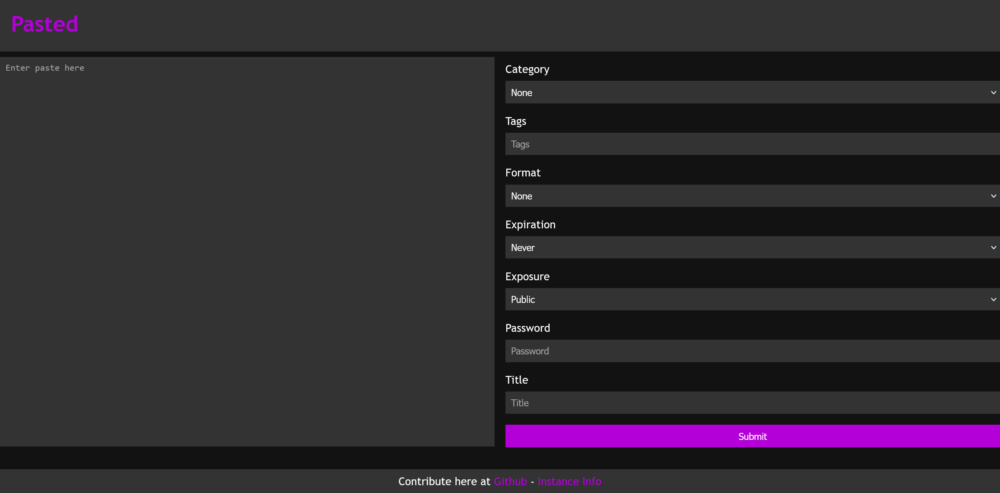
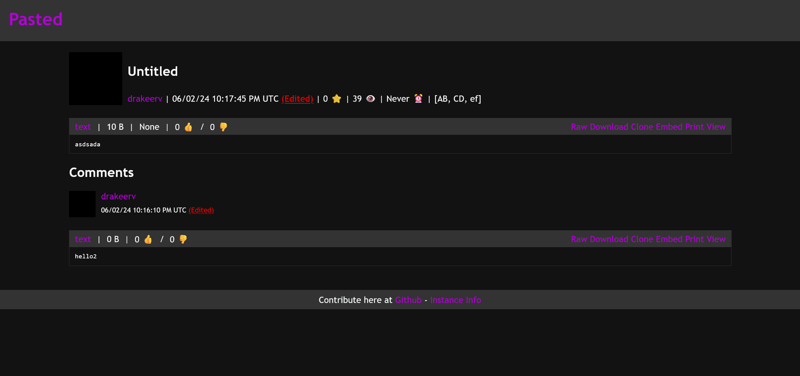

# Pasted

## What is it?

Pasted is a free, privacy respecting frontend for pastebin written in Rust. It is designed to use no javascript and be as simple as possible while also maintaining as many features as possible.

## Screenshots

# Self Host

We made a docker image! It is availible at [ghcr.io/dragynfruit/pasted:latest](https://github.com/dragynfruit/pasted/pkgs/container/pasted)
By default this uses port 3000 with host 0.0.0.0. To change this you can set the environment variables PORT and HOST accordingly.
A premade docker-compose is availible [here.](docker-compose.yml)

## Future

Currently, the goal is to only do pastebin, but in the future I am looking to make a frontend to all the major pastebin alternatives aswell, all in one.

## Todo

- [x] Read paste content
- [x] Create post
- [x] Parse paste and comments
- [x] Proxy user icons
- [x] Make simple homepage and info page
- [x] Make info api
- [x] Comments
- [x] Make simple paste view page
- [x] Embed paste
- [x] Clone Paste
- [x] Mobile layout
- [x] Error handling
- [x] Password protected pastes
- [x] Burn on read
- [x] Icon cache
- [x] User page
- [x] Archive page
- [ ] Markdown paste support
- [ ] View deleted pastes
- [x] Last edited
- [x] (Docker) Persitent cache volume
- [ ] Allow users with accounts

